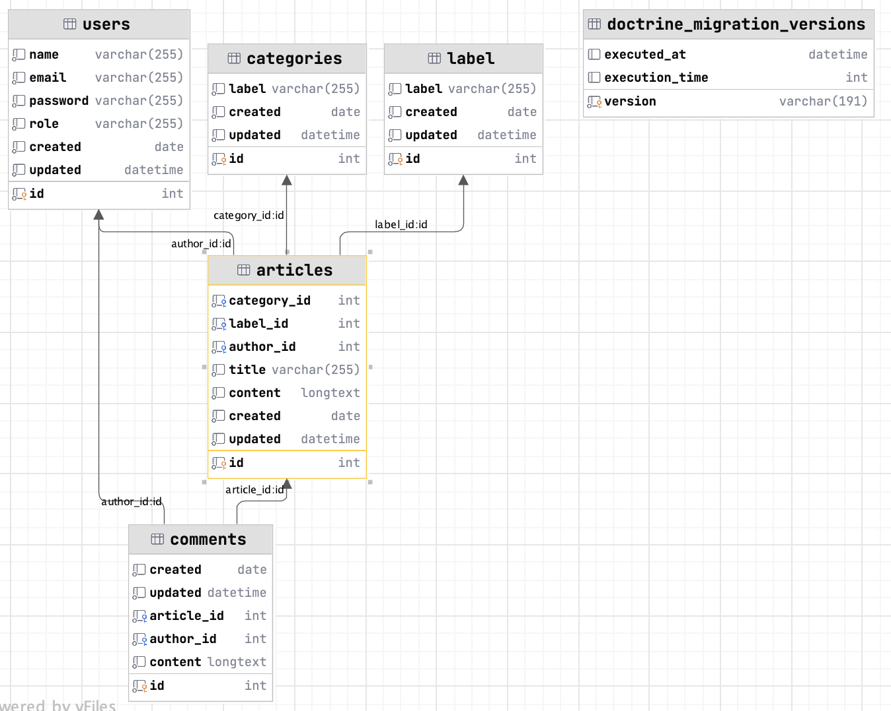

# Reudit 

## Sujet

**BDD**

    [x]    Table des utilisateurs : Nom d'utilisateur, adresse e-mail, mot de passe, rôle.
    [x]    Table des articles : Titre, contenu, date de publication, catégorie, étiquettes, auteur.
    [x]    Table des catégories : Nom de la catégorie.
    [x]    Table des étiquettes : Nom de l'étiquette.
    [x]    Table des commentaires : Contenu du commentaire, date de publication, id de l'article, id de l'utilisateur.

- Faire un shéma de notre base de données 
- Crée ton projet avec la ou les techno(s) choisi. Si tu as 2 technos = tu fais 2 projets (dans un même dossier)
  - **Symfony** : pour la réalisation de mon API
  - **React** : Pour la réalisation de mon application web

**Qu'est-ce qui est vraiment IMPORTANT pour atteindre le MVP ?**

    []    Ajouter, modifier et supprimer des articles.
    []    Ajouter, modifier et supprimer des catégories et des étiquettes.
    []    Gérer les commentaires.
    []    Authentification et autorisation des utilisateurs.
    []    Recherche de contenu.

**Fonctionnalités à ajouter :**

    []    Ajouter des fonctionnalités pour gérer les médias tels que les images et les vidéos.
    []    Ajouter des fonctionnalités pour planifier la publication des articles.
    []    Ajouter des fonctionnalités pour partager le contenu sur les réseaux sociaux.
    []    Ajouter des fonctionnalités pour suivre les performances des articles en termes de vues et d'engagement.
    []    Ajouter des fonctionnalités pour gérer les abonnements et les newsletters.
    []    Ajouter des fonctionnalités de personnalisation pour permettre aux utilisateurs de personnaliser l'apparence du site.
    []    Ajouter des fonctionnalités de traduction pour permettre aux utilisateurs de traduire le contenu dans différentes langues.


## Back-end // API

- Symfony 

### `symfony server:start`

```bash
# Create entity
php bin/console make:entity

# Create controller
symfony console make:controller

# Make migration
php bin/console make:migration
php bin/console doctrine:migrations:migrate
```

[Link to localhost](http://127.0.0.1:8000)

## Front-end // application

- React

### `npm start`

[Link to localhost](http://localhost:3000)

## Ressource(s)



### Relations

**Utilisateur - Article**
- 1 utilisateurs : plusieurs articles
- 1 articles : 1 utilisateurs

- -> ManyToOne

**Utilisateur - Commentaire**
- 1 utilisateur : plusieurs commentaires
- 1 commentaire : plusieurs utilisateurs

-> ManyToOne

**Article - Label**
- 1 label : plusieurs articles
- 1 articles : 1 label

-> ManyToOne

**Article - Catégorie**
- 1 catégorie : plusieurs articles
- 1 articles : 1 catégorie

-> ManyToOne

**Article - Commentaire**
- 1 article : plusieurs commentaires
- 1 comentaire : 1 article

-> ManyToOne

### Roles

- **ROLE_ADMIN**
  - Read all users
  - Read one user
  - Update one user : role
  - Delete user
  - Delete any articles
  - Delete any comments
  - Delete any users
  - ROLE_USER
  

- **ROLE_USER**
  - Create article
  - Update own article
  - Delete own article
  - Add comment on article 
  - Update own comment 
  - Delete own comment 
  - Create an account
  - Read own account information
  - Update own account
  - Delete own account
  - Login / Logout
  - PUBLIC ACCESS (NO ROLE)


- **PUBLIC ACCESS (NO ROLE)**
  - Read all articles
  - Read one article
  - Read article's comments
  - Search article